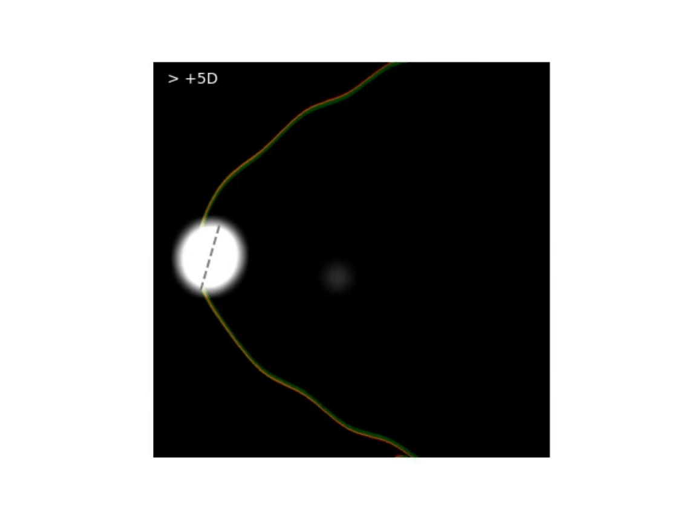
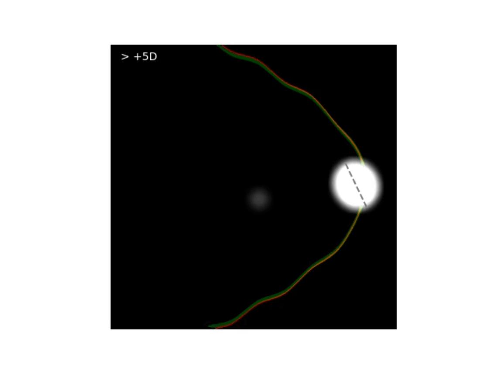
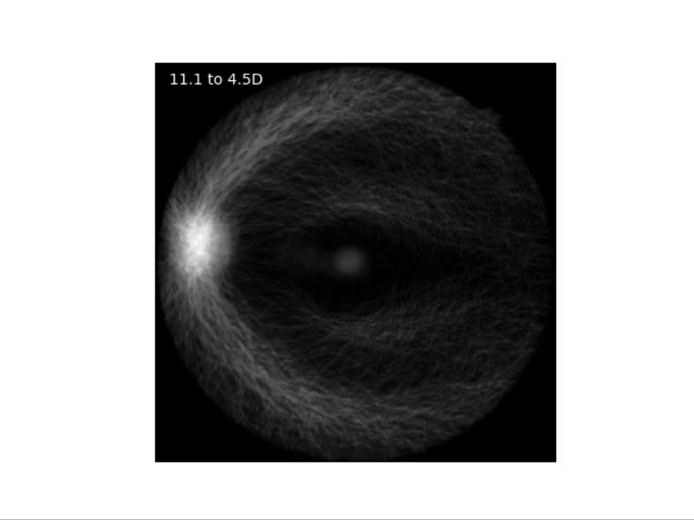
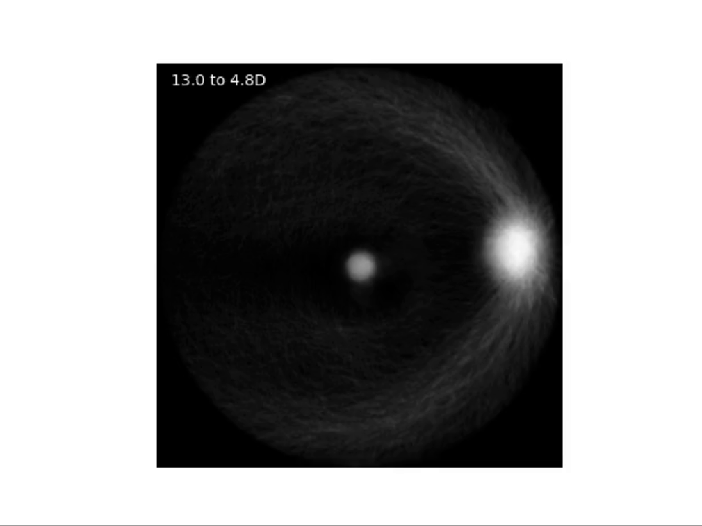

## This repository contains the source code for the following [work](https://iovs.arvojournals.org/article.aspx?articleid=2793667):
```
Yii F, Bernabeu MO, Dhillon D, Strang N, MacGillivray T. Retinal changes from hyperopia to myopia: Not all dioptres are created equal. Invest. Ophthalmol. Vis. Sci. 2024;65(5):25. https://doi.org/10.1167/iovs.65.5.25.
```

An overview of the workflow is provided below (source code in the directory named "code").

### Step 1: Participant selection
<pre>
SER_cohort_builder.R : R script for selecting eligible eyes/participants for the study.
</pre>

<p align="center">
  
</p>

### Step 2: Segmentation of regions of interest
<pre>
OD_segmentation : Folder containing a custom-trained deep learning model (DeepLabV3 with a MobileNetV3 large backbone) used for optic disc segmentation. 

Disc segmentation model is freely/openly available, provided that appropriate credit is given (see Note 1).
</pre>
*Note 1: Additional details about the disc segmentation model can be found in [Yii et al.](https://doi.org/10.1007/978-3-031-47425-5_30). Model weights are available for download from this repository.* 

*Note 2: Artery/vein segmentation was performed using AutoMorph, which is freely and openly available [here](https://github.com/rmaphoh/AutoMorph/tree/main).*

*Note 3: Foveal segmentation/localisation was performed using a DU-Net model from [VAMPIRE](https://vampire.computing.dundee.ac.uk/index.html).*


### Step 3: Retinal parameters
<pre>
ODfovea_analysis.m : MATLAB script for computing optic disc and foveal parameters, which are detailed in the paper.

vascularArcade     : Folder containing python scripts (see below) for deriving temporal arterial/venous concavity from the segmented retinal vasculature.    
  preprocess.py      Used to preprocess the artery/vein mask and detect the major temporal artery/vein
  arcade_model.py    Used to fit a second-degree polynomial function to the preprocessed vascular arcade using either the least squares or RANSAC method.
  main.py            Calls *preprocess.py* and *arcade_model.py* to compute vessel concavity.
</pre>
*Note 1: Other vascular metrics, including central retinal arteriolar/venular equivalent, vessel tortuosity and vessel fractal dimension, were computed using [AutoMorph](https://github.com/rmaphoh/AutoMorph/tree/main).*


### Step 4: Linear and quantile regression
<pre>
linear_and_quantile_regression.R : R script used to perform multiple linear regression and quantile regression, as detailed in the paper.
</pre>


# Animations

**Top&nbsp;&nbsp;&nbsp;&nbsp;&nbsp;&nbsp;&nbsp;&nbsp;&nbsp;:** &nbsp;Simulations using the mean value of each retinal parameter* stratified by refractive error (from high hyperopia to high myopia)

**Bottom   &nbsp;:** &nbsp;Average segmentation mask* stratified by refractive error (from high hyperopia to high myopia)


Left eye |Right eye 
--|--
|

*Red vascular arcade: artery; green vascular arcade: vein; broken line: major axis of the optic disc*

*adjusted for ocular magnification where necessary


Left eye |Right eye
--|--
|

*ocular magnification cannot be accounted for


