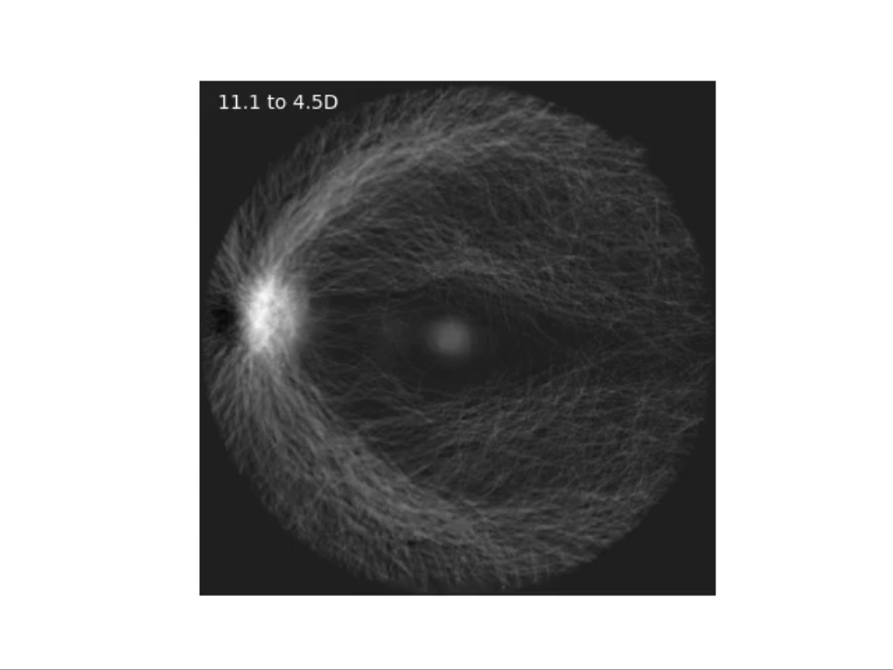
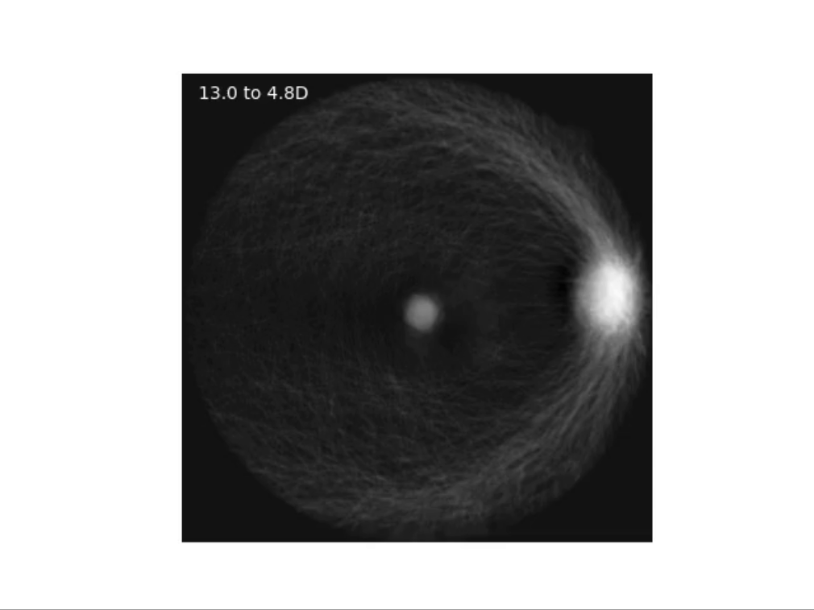

## Intro

Left eye (simulated)|Right eye (simulated)
--|--
|

Left eye (average mask)|Right eye (average mask)
--|--
|

Left eye (top eigenvector)|Right eye (top eigenvector)
--|--
|

======================================= Note: still under construction =======================================
Anonymised imaging data derived from colour fundus photographs and other relevant variables can be found in the 'data' directory (*derivedDataAnonymised.csv*). The dataset contans 374 rows and 40 columns. Each row corresponds to an eye from a unique individual. The codebook below summarises the content of the dataset:

| Column name | Data type | What it represents |
| :---:   | :---: | :---: |
| **name** | Integer | Index corresponding to a unique image/individual |
| **age** | Integer | Age at the time of data collection (including image acquisition) |
| **ser** | Numeric | Spherical equivalent refraction (autorefraction) in dioptres, i.e. sph + 0.5*cyl |
| **cr** | Numeric | Mean of corneal radius in the strongest and weakest meridians (mm) |
| **sph** | Numeric | Spherical power (dioptres)  |
| **cyl** | Numeric | Cylindrical power (dioptres) |
| **dist** | Numeric | Distance between OD and fovea in pixels |
| **adj_dist** | Numeric | Distance between OD and fovea in pixels adjusted for the effect of magnification due to ametropia |
| **vertical_angle** | Numeric | Angle between OD and fovea |
| **od_area** | Numeric | Area of OD (total number of pixels)  |
| **adj_od_area** | Numeric | Area of OD (total number of pixels) adjusted for the effect of magnification due to ametropia |
| **major_length** | Numeric | OD major axis length (pixels) |
| **adj_major_length** | Numeric | OD major axis length (pixels) adjusted for the effect of magnification due to ametropia |
| **minor_length** | Numeric | OD minor axis length (pixels) |
| **adj_minor_length** | Numeric | OD minor axis length (pixels) adjusted for the effect of magnification due to ametropia |
| **macula_intensity** | Numeric | Median pixel intensity (grayscale) of central macula (fovea)  |
| **macula_intensity_R** | Numeric | Median pixel intensity of central macula (fovea) in the red channel |
| **macula_intensity_G** | Numeric | Median pixel intensity of central macula (fovea) in the green channel |
| **macula_intensity_B** | Numeric | Median pixel intensity of central macula (fovea) in the green channel |
| **scaled_macula_intensity** | Numeric | Median pixel intensity (grayscale) of central macula (fovea) adjusted for background intensity of the entire grayscale image |
| **scaled_macula_intensity_R** | Numeric | Median pixel intensity of central macula (fovea) in the red channel adjusted for background intensity of the entire image in the red channel |
| **scaled_macula_intensity_G** | Numeric | Median pixel intensity of central macula (fovea) in the red channel adjusted for background intensity of the entire image in the green channel |
| **scaled_macula_intensity_B** | Numeric | Median pixel intensity of central macula (fovea) in the red channel adjusted for background intensity of the entire image in the blue channel |
| **median_intensity_R** | Numeric | Median background pixel intensity of the entire image in the red channel |
| **median_intensity_G** | Numeric | Median background pixel intensity of the entire image in the green channel |
| **median_intensity_B** | Numeric | Median background pixel intensity of the entire image in the blue channel |
| **median_intensity** | Numeric | Median background pixel intensity of the entire grayscale image |
| **orientation** | Numeric | OD orientation relative to the horizontal axis, i.e. 0 (horizontal) to 90 (vertical) |
| **disc_x** | Numeric | X-coordinate of OD centroid |
| **disc_y** | Numeric | Y-coordinate of OD centroid |
| **macula_x** | Numeric | X-coordinate of macular centroid (fovea) |
| **macula_y** | Numeric | Y-coordinate of macular centroid (fovea) |
| **sex** | Character | Female or male |
| **VA** | Numeric | Distance visual acuity in LogMAR |
| **cataract** | Boolean | Self-reported (touch-screen questionnaire) cataract at the time of data collection |
| **diabetic_eye** | Boolean | Self-reported (touch-screen questionnaire) diabetes-related eye condition at the time of data collection |
| **md** | Boolean | Self-reported (touch-screen questionnaire) macular degeneration at the time of data collection |
| **ethnicity** | Character | Self-reported ethnicity |
| **glaucoma** | Boolean | Self-reported (touch-screen questionnaire) glaucoma at the time of data collection |
| **eye** | Character | Right eye or left eye |

### 1) ***computeODfoveaParameters.m***
MATLAB script that extracts and computes relevant OD and foveal parameters from masked images (i.e. showing only OD and macula)

### 2) ***linearRegression.R***
R script that runs on *derivedDataAnonymised.csv* to assess the (univariable & multivariable) linear associations between relevant OD/foveal parameters and SER. Additional & sensitivity analyses (e.g. SER vs OD-fovea distance using third degree polynomial and segmented linear regression functions) can also be reproduced by running the script.

### 3) ***RFanalysis.ipynb***
Python script (Jupyter Notebook) that runs on *derivedDataAnonymised.csv* to assess the relative importance of each OD/foveal parameter (in addition to age and sex) in the prediction of SER using a permutation-based approach. Details pertaining to hyperparameter tuning (via grid search), model fitting and construction of "eigendiscs" (stratified by refractive error and eye) can also be found.
